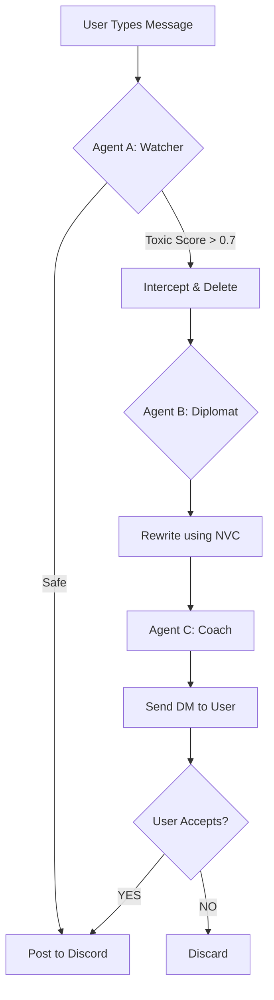
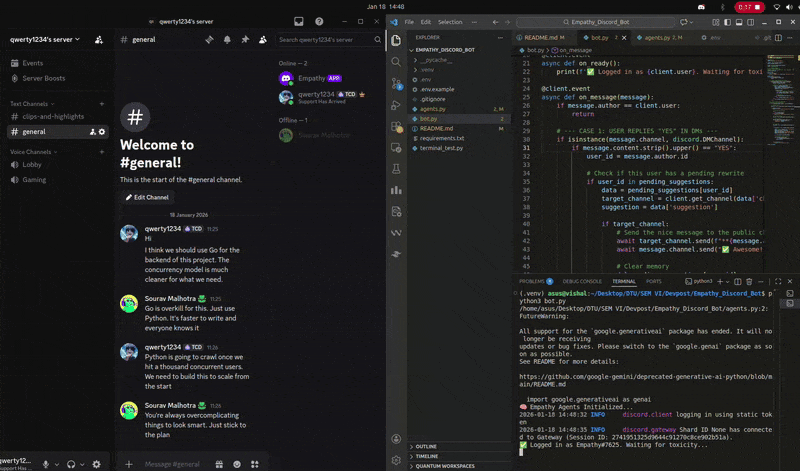
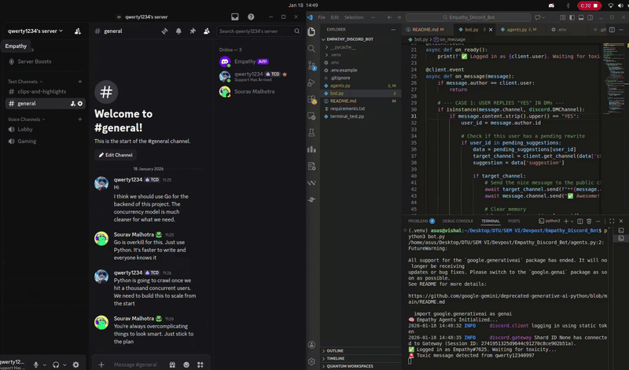

# **🛡️ The Empathy Bridge**

### **Submission for United Hacks V6 | Theme: Human Interaction**
 
**"Bridging the gap between what we feel and what we should say."**

## **💡 Inspiration: The Communication Crisis**

Online communities often lack the nuance of face-to-face interaction. A simple misunderstanding can spiral into toxicity because we lack a "pause button." Most moderation bots are punitive—they mute or ban users.

**We wanted to build something restorative.**

**The Empathy Bridge** acts as a real-time emotional translator. It intercepts toxicity *before* it reaches the public chat and coaches the user to rephrase their intent using **Non-Violent Communication (NVC)** principles.

## **🚀 How It Works (The Multi-Agent System)**

Instead of a single AI prompt, we utilize a **Multi-Agent Architecture** to handle different stages of the interaction loop.


### **1\. Agent A: The Watcher 👁️**

* **Role:** Real-time Sentiment Analysis.  
* **Logic:** Monitors public channels. If a message's "Toxicity Score" exceeds a threshold (0.7), it is instantly intercepted (deleted) from the public view.  
* **Tech:** Google Gemini 1.5 Flash (Optimized for low latency).

### **2\. Agent B: The Diplomat 🤝**

* **Role:** Conflict Resolution Specialist.  
* **Logic:** It takes the toxic message and rewrites it. It strips away the aggression but **preserves the underlying need**, converting insults into constructive requests.  
* **Example:**  
  * *Input:* "You are stupid for writing this code."  
  * *Output:* "I'm feeling confused about this logic. Could you explain it to me?"

### **3\. Agent C: The Coach 🗣️**

* **Role:** User Education (Private DM).  
* **Logic:** Sends a private Embed to the user explaining *why* the message was paused and offering the Diplomat's suggestion. If the user replies **"YES"**, the bot posts the polite version on their behalf.

## **🎥 Demo**

[Demo Video](https://youtu.be/FEX8mCSX4no)

## **🛠️ Tech Stack**

* **Language:** Python 3.12  
* **Interface:** discord.py (Asynchronous bot framework)  
* **Intelligence:** Google Gemini API (google-generativeai)  
* **Architecture:** Modular Agent System (Watcher/Diplomat/Coach)

## **⚙️ Installation & Setup**

### **Prerequisites**

* Python 3.8 or higher  
* A Discord Account & Bot Token  
* Google Gemini API Key

### **1\. Clone the Repository**

```sh
git clone https://github.com/vb8146649/Empathy_Discord_Bot.git
cd Empathy_Discord_Bot
```
### **2\. Install Dependencies**

```sh
pip install -r requirements.txt
```
### **3\. Configure Environment**

Create a .env file in the root directory and add your keys:

```
DISCORD_TOKEN=your_discord_bot_token_here  
GOOGLE_API_KEY=your_gemini_api_key_here
```
### **4\. Run the Bot**
```
python bot.py
```
*You should see: ✅ Logged in as EmpathyBridge. Waiting for toxicity...*

## **📸 Screenshots**

### **The Interception**



### **The Coaching Session (DM)**


## **🔮 Future Roadmap**

* **🎙️ Voice Chat Integration:** Using **LiveKit** to perform real-time sentiment analysis on audio streams, detecting aggression in tone/pitch.  
* **📊 Server Dashboard:** A web UI for admins to see how many conflicts were "bridged" and resolved peacefully.  
* **🌍 Multi-Language Support:** Translating and de-escalating conflicts between users speaking different languages.

## **📜 License**

Distributed under the MIT License. See LICENSE for more information.

### **Built with ❤️ for United Hacks V6**